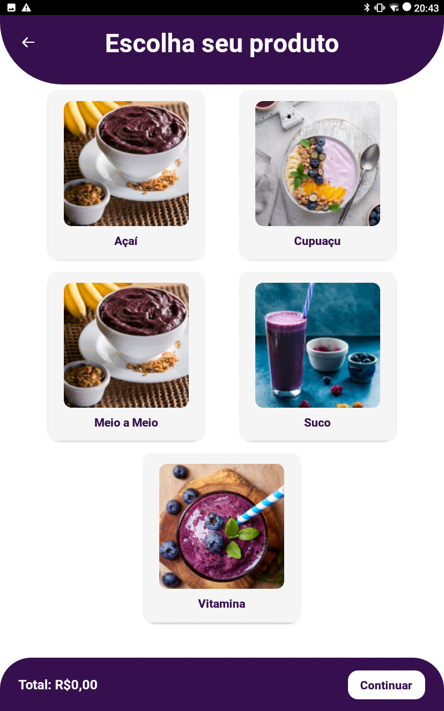
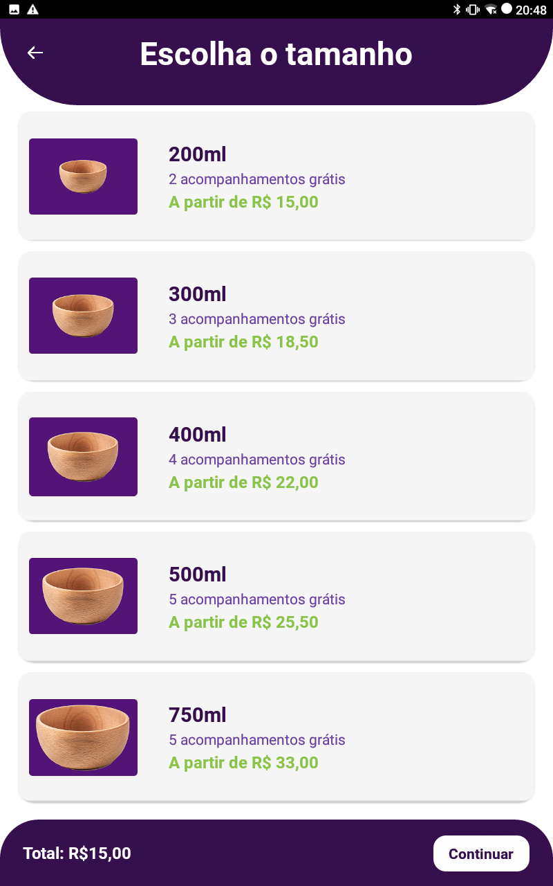
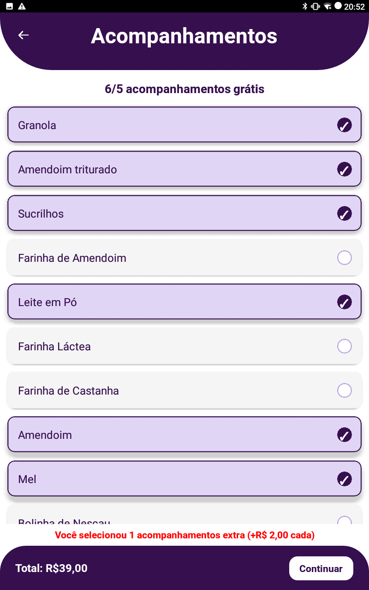
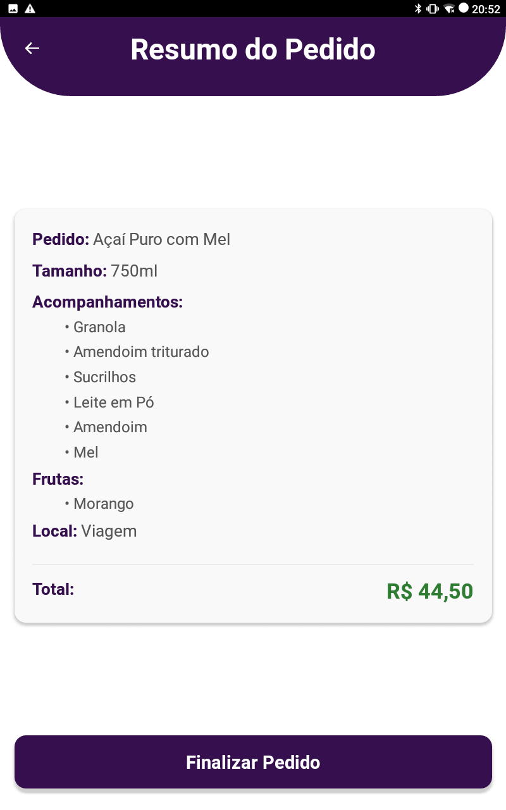
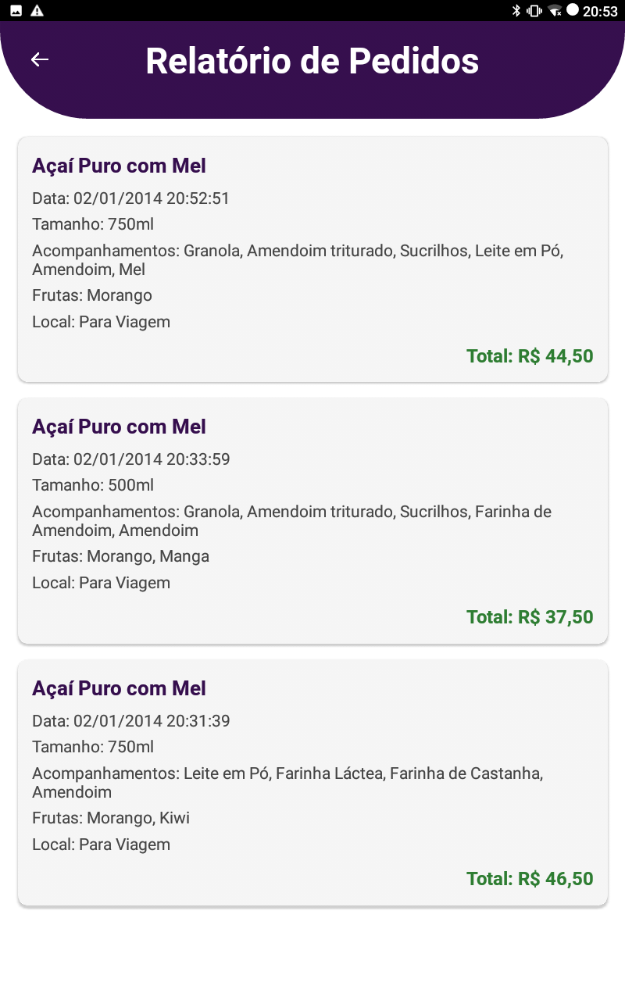
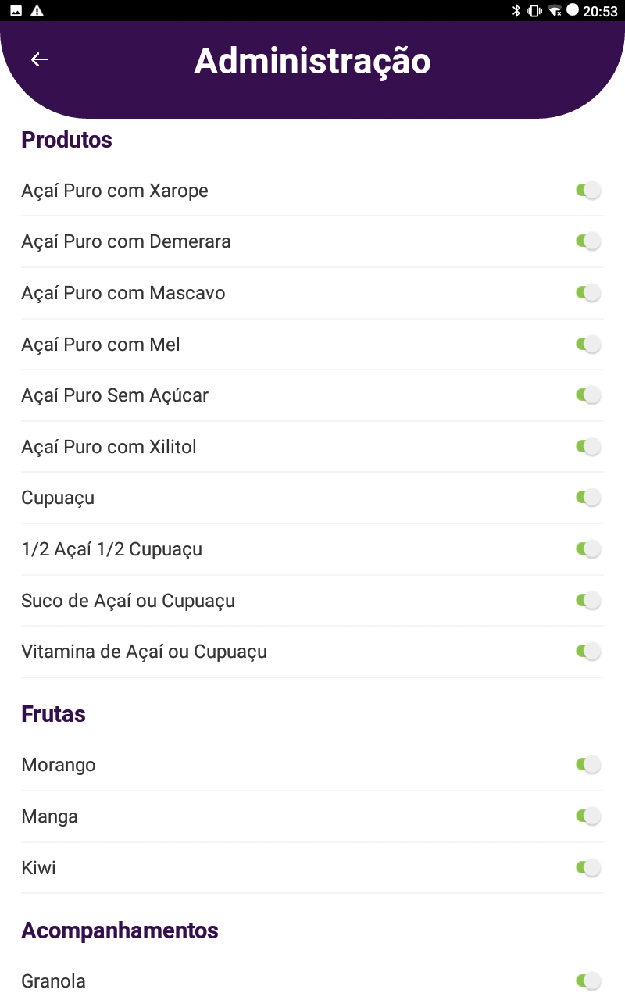

# Lounge do Açaí - Sistema de Autoatendimento

Este projeto é um sistema de autoatendimento desenvolvido para melhorar a experiência do atendimento no quiosque do **Lounge do Açaí** na Universidade Católica de Pernambuco. 

## Sobre o Lounge do Açaí
O Lounge do Açaí é um espaço dedicado a oferecer o melhor açaí da cidade. Açaí autêntico paraense da forma que tem que ser.

 
[Visite o Instagram do Lounge](https://www.instagram.com/oloungedoacai?utm_source=ig_web_button_share_sheet&igsh=ZDNlZDc0MzIxNw==)

## Funcionalidades 
- Interface intuitiva e bonita para seleção de produtos.
- Personalização de pedidos (tamanhos, adicionais, etc.).
- Relatórios detalhados dos pedidos.
- Painel administrativo para gerenciamento de disponibilidade do menu.

## Futuras Adições
- Impressão de pedidos via Bluetooth em impressoras a laser.
- Compartilhamento dos relatórios por e-mail.
- Painel administrativo para gerenciamento dos valores dos produtos.

## Algumas Telas da Aplicação

|  |  |  |
| :----------: | :----------------: | :------------: |
|  |  |  |

